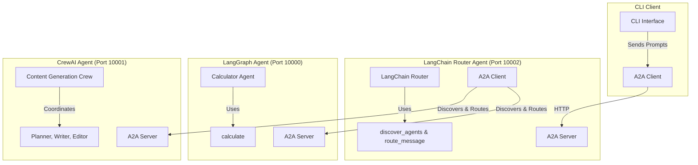

# Sample Code

This code demonstrates A2A (Agent-to-Agent) capabilities through a collection of agents and clients. The system consists of three specialized agents and a CLI client, all communicating via the A2A protocol over HTTP.

## Architecture



## Communication Flow

1. The CLI client connects exclusively to the LangChain Router Agent
2. The LangChain Router Agent:
   - Uses its `discover_agents()` tool to find other available agents
   - Routes messages to either LangGraph Calculator or CrewAI Content Generation agents using its `route_message()` tool
   - Maintains the session context and handles responses

## Agents

### 1. LangChain Router Agent (Port 10002)

A specialized routing assistant that acts as the central hub for agent communication:

- Discovers other A2A agents using `discover_agents()`
- Routes messages to appropriate specialized agents using `route_message()`
- Makes routing decisions based on the content of user requests
- Maintains session context across different agent interactions

### 2. LangGraph Calculator Agent (Port 10000)

A mathematical computation agent that:

- Performs complex calculations using Python math functions
- Supports streaming responses
- Handles push notifications
- Core tool: `calculate()` for mathematical expressions
- Examples: arithmetic, trigonometry, square roots

### 3. CrewAI Content Generation Agent (Port 10001)

A collaborative content generation system using multiple specialized agents:

- Planner: Develops content structure and outlines
- Writer: Creates initial content drafts
- Editor: Refines and polishes the content
  Features:
- Sequential processing workflow
- Specialized roles for each stage
- Comprehensive content generation pipeline

## CLI Client

The CLI client serves as an A2A protocol client that:

- Connects to any of the available agents
- Supports interactive prompting via terminal
- Handles file attachments
- Manages streaming responses
- Supports push notifications
- Maintains session history

## Prerequisites

- Python 3.13 or higher
- [UV](https://docs.astral.sh/uv/)

## Running the Demo

Run all the [agents](/app/agents/README.md) A2A servers and then start the CLI client. Follow these steps:

1. Navigate to the LangGraph agent directory:
   ```bash
   cd app/agents/langgraph
   ```
2. Start the LangGraph agent:

   ```bash
   uv run .
   ```

3. In another terminal, navigate to the CrewAI agent directory:
   ```bash
   cd app/agents/crewai
   ```
4. Start the CrewAI agent:

   ```bash
   uv run .
   ```

5. In another terminal, navigate to the LangChain agent directory:
   ```bash
   cd app/agents/langchain
   ```
6. Start the LangChain agent:

   ```bash
   uv run .
   ```

7. Finally, in another terminal, navigate to the CLI directory:
   ```bash
   cd app/hosts/cli
   ```
8. Start the CLI client:
   ```bash
   uv run .
   ```

---

**NOTE:**
This is sample code and not production-quality libraries.

---
