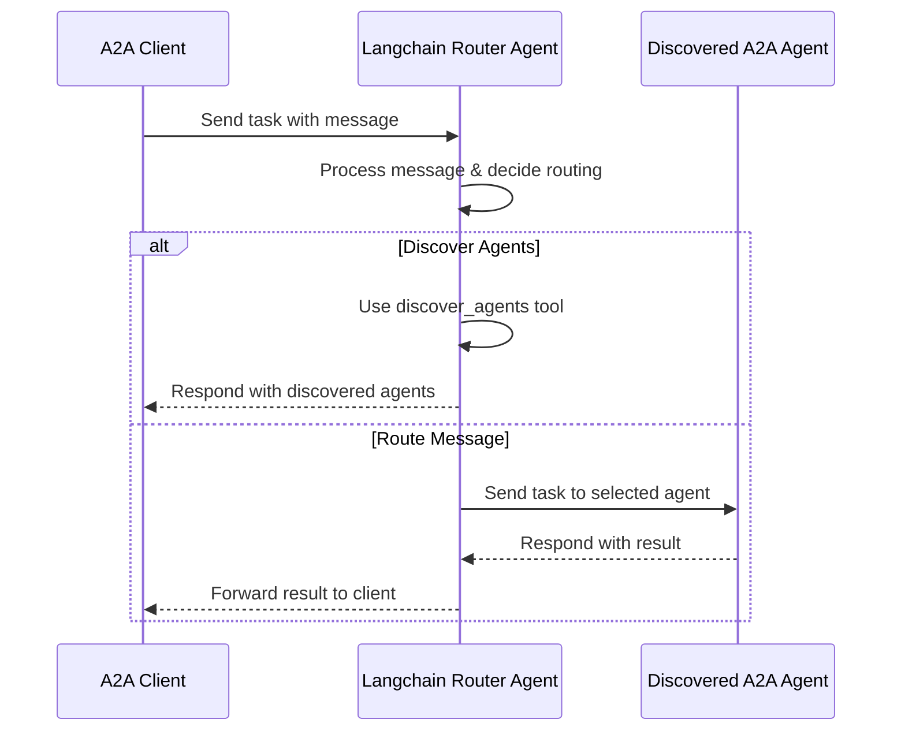

# Langchain Router Agent with A2A Protocol

This sample demonstrates a router agent built with [Langchain](https://www.langchain.com/) and exposed through the A2A protocol. This agent can discover other A2A agents and route incoming messages to the most appropriate agent based on their capabilities.

## How It Works

This agent uses Langchain to process incoming messages and decide which discovered agent should handle the request. It includes a tool to discover other A2A agents at predefined URLs. The agent's logic (currently simplified) determines the target agent and forwards the message using the A2A protocol.



## Key Features

- **Agent Discovery**: Uses a tool to find other A2A agents.
- **Message Routing (Simplified)**: Basic logic to decide where to send messages.
- **A2A Protocol Integration**: Standardized interaction with the agent.

## Prerequisites

- Python 3.12 or higher
- [UV](https://docs.astral.sh/uv/)
- Access to a Langchain-supported Language Model (e.g., Google Gemini, Ollama) and potentially an API Key depending on the model.

## Setup & Running

1. Navigate to the samples directory:

   ```bash
   cd samples/python/agents/langchain
   ```

2. (Optional) Create an environment file with your API key if required by your chosen LLM:

   ```bash
   echo "YOUR_API_KEY_NAME=your_api_key_here" > .env
   ```

   Replace `YOUR_API_KEY_NAME` with the actual environment variable name required by your LLM (e.g., `GOOGLE_API_KEY`).

3. Set up the Python environment and install dependencies:

   ```bash
   uv python pin 3.12
   uv venv
   source .venv/bin/activate
   uv install -r requirements.txt # You might need to create a requirements.txt or install from pyproject.toml
   ```

   _(Note: You might need to adjust the installation command based on how you manage dependencies with UV and pyproject.toml)_

4. Configure your Language Model in `agent.py` by replacing the `model = None` line with your LLM initialization code.

5. Run the agent:

   ```bash
   # Basic run on default port 10002
   uv run .

   # On custom host/port
   uv run . --host 0.0.0.0 --port 8080
   ```

6. In a separate terminal, run an A2A [client](/samples/python/hosts/README.md) and connect to the Langchain Router Agent:

   ```bash
   cd samples/python/hosts/cli
   uv run . --agent http://localhost:10002
   ```

## Technical Implementation

- **Langchain Agent**: Uses Langchain for message processing and tool usage.
- **Agent Discovery Tool**: Implemented using `A2ACardResolver`.
- **Message Routing**: Basic logic implemented in `agent.py` (can be extended).
- **A2A Protocol Integration**: Full compliance with A2A specifications for receiving and sending tasks.

## Limitations

- Simplified message routing logic.
- Streaming is not currently supported.
- Assumes text-based input/output for routing.

## Examples

_(Examples will be added once the routing logic is more developed.)_

## Learn More

- [A2A Protocol Documentation](https://google.github.io/A2A/#/documentation)
- [Langchain Documentation](https://python.langchain.com/v0.2/docs/introduction/)
